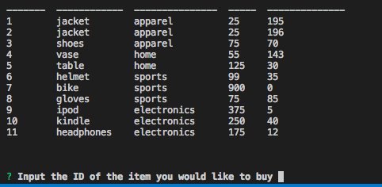
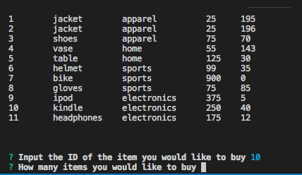
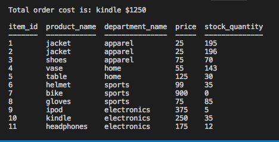

Similar to the Amazon online marketplace, bamazon is designed to track 10 items in stock, as well as track which items the customer/user wants to buy, now much their total sale is and what the final inventory count is after the sale has been confirmed.

; prompt to user re: purchase needs.
; prompt to user re: order qty.
; prompt to user re: order info and inventory remaining.

